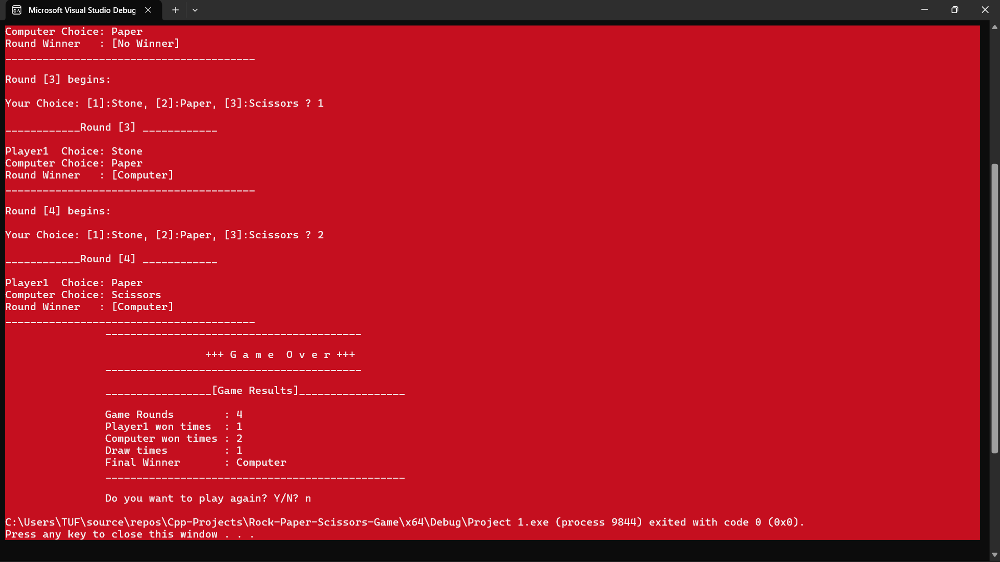

# Rock Paper Scissors Game 🎮

A console-based Rock Paper Scissors game developed in C++.

## About the Project

This project allows the player to play multiple rounds of Rock Paper Scissors against the computer. The computer generates a random choice for each round, and the program determines the winner automatically.

## Features

- Choose the number of rounds
- Player vs Computer gameplay
- Random computer choices
- Determines the winner of each round
- Displays round results
- Calculates the final game winner
- Tracks player wins, computer wins, and draws
- Changes the console color based on the game result
- Option to play again
## Game Output

## Technologies Used

- C++
- Visual Studio
- Console Application

## Concepts Practiced

- Functions
- Structures (struct)
- Enumerations (enum)
- Loops
- Conditional statements
- Random number generation
- Modular programming

## Author

Basel Qashou
